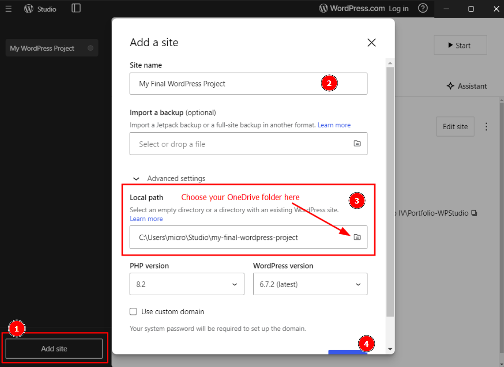
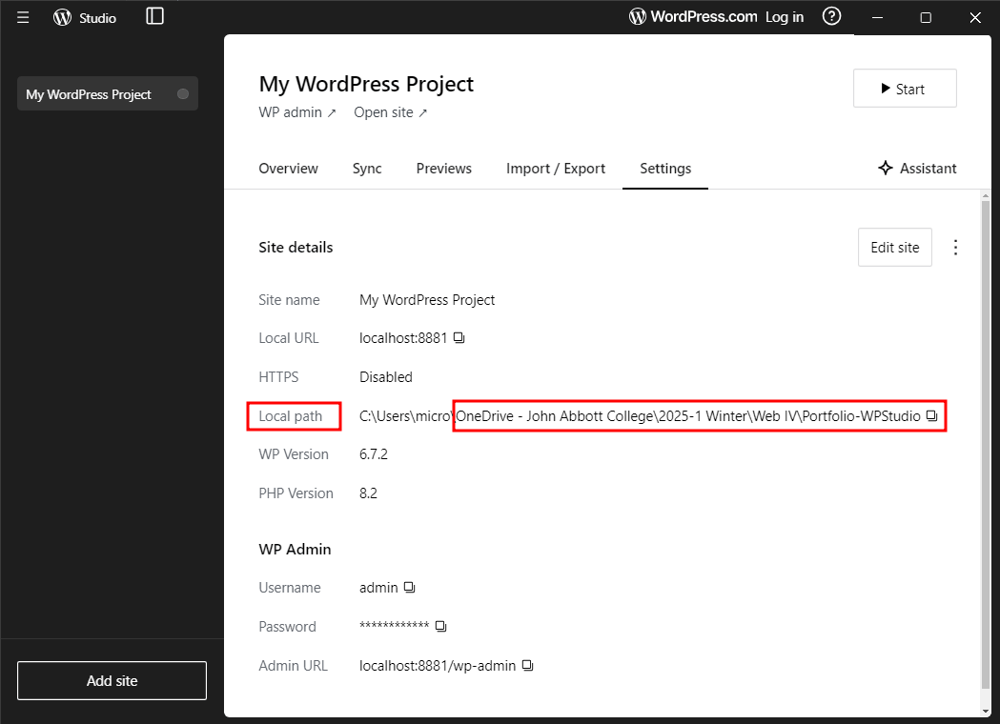

# How to setup Wordpress Studio and OneDrive

## Setup OneDrive at School

See the [detailed instructions from Microsoft here](https://support.microsoft.com/en-us/office/sync-files-with-onedrive-on-macos-d11b9f29-00bb-4172-be39-997da46f913f).

1. Login to the OneDrive **desktop application** with your school credentials
2. Complete the setup process
3. Make sure OneDrive is running

## Initial Setup of Wordpress Studio

WordPress Studio is by far the easiest way to run Wordpress on your desktop. However, it was not designed to support syncing between different machines (ie school and at home). This is why we use OneDrive. So all the default settings are fine *except for the location of the folder which must be in OneDrive*.

1. If at home: [download WordPress Studio](https://developer.wordpress.com/studio/)
2. Open WordPress Studio
3. Click Add Site
3. Click Advanced Settings
4. Select a folder in OneDrive as location where Wordpress will be installed (ex: fourth-semester/web-iv/wordpress-project-1/)
5. Go into Finder (Mac) or Windows Explorer (PC), right-click the folder you just created in OneDrive and select "Always keep on this device".
 

## Setting up Wordpress Studio at Home

Assuming you created your Wordpress Studio site inside your OneDrive at school:

At home:

1. Open WordPress Studio
2. Click Add Site
3. Click Advanced Settings
4. **Select your WP folder in OneDrive as the web site folder**
5. Go into Finder (Mac) or Windows Explorer (PC), right-click the WordPress Studio folder in OneDrive and select "Always keep on this device".

Your entire site including your theme should all be up to date.

